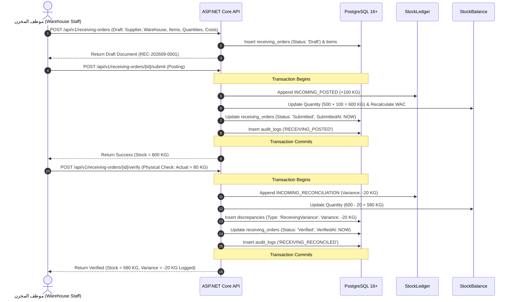
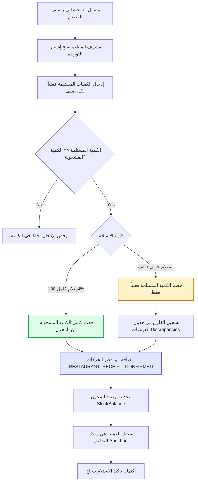

# 04 — End-to-End Business Flow & Lifecycle Specification

> **Document ID:** SPEC-FLOW-04  
> **Topic:** Master End-to-End Business Workflows, State Machines, Concurrency, and Invariants  
> **Target Audience:** Engineering, Implementation Agents (Claude), System Architects, QA  
> **Status:** Authoritative Engineering & Business Baseline (Clean Restart v1.0)  
> **Revision:** Reconciled — incorporates ADR-012 … ADR-026. Conflicts resolved here are catalogued in `docs/32-specification-conflict-register.md`.

---

## 1. Document Purpose & Scope

This specification defines the complete, authoritative lifecycle of inventory and supply operations across the multi-tenant enterprise system. It covers every business workflow from initial master-data provisioning through supplier receiving, warehouse inventory management, multi-item restaurant supply requests, fulfillment, dispatch, physical receipt confirmation, discrepancy tracking, kitchen consumption logging, and warehouse stock counts.

For every operational transition, this document establishes:
- **Who:** The authenticated actor, role, and data scope required.
- **When:** The trigger condition and preceding document state.
- **What Changes:** The exact entity states, database records, and stock ledger rows created.
- **What Must NOT Change:** Explicit invariants protecting balances, historical records, and scopes.
- **Stock Impact:** The exact mathematical change to the warehouse's physical balance.
- **Audit & Security:** Transactional audit logs created and role-denial restrictions enforced.
- **Failure & Concurrency:** Error handling, atomic rollbacks, idempotency, and race condition guards.

---

## 2. Inviolable Business Principles & System Invariants

The following 14 rules are absolute and must never be overridden:

1. **Warehouse-Only Inventory Ownership:** Only warehouses possess physical inventory balances.
2. **Zero Restaurant Stock:** Restaurants **never** have stock balances, on-hand balances, or asset valuations.
3. **Prohibited Tables:** Never create `restaurant_stock`, `restaurant_inventory`, `restaurant_on_hand`, `restaurant_in_transit`, or `restaurant_inventory_balance`.
4. **No In-Transit Balances:** In-transit goods are not tracked as a restaurant inventory asset.
5. **Dispatch Invariant:** Dispatching a shipment from a warehouse **DOES NOT** decrease warehouse stock.
6. **Confirmation Deduction:** Warehouse stock decreases **strictly and exclusively** when the Restaurant Supervisor confirms actual physical receipt at the restaurant dock (or via approved count adjustments/reconciliation).
7. **Consumption Invariant:** Restaurant kitchen consumption records **DO NOT** modify warehouse stock balances.
8. **Movement Sourcing:** Every change to physical stock must originate from an append-only row in `StockLedger`.
9. **No Direct Writes:** There is no generic "set stock" endpoint or manual balance overwrite capability.
10. **Client Untrusted:** Clients cannot supply conversion factors, variances, base quantities, or costs.
11. **Server-Generated Identifiers:** All document numbers and item codes are generated exclusively by the server.
12. **Immutable Codes:** Generated business identifiers cannot be manually entered or edited.
13. **Arabic-First UI:** All user-facing business terminology, labels, dialogs, and errors are Arabic-only.
14. **No Dead English Fields:** Master data tables do not store `name_english` or `barcode` fields.

---

## 3. Product Roles & Operational Boundaries

The system supports **exactly five** product roles. The historical `Accountant` role is permanently retired.

```
┌─────────────────────────┐
│          Owner          │ ──► Highest authority; full operational, financial, and audit visibility.
└────────────┬────────────┘
             │
   ┌─────────┼─────────┐
   ▼         ▼         ▼
┌──────┐ ┌──────┐ ┌──────┐
│Admin │ │Staff │ │Superv│
└──────┘ └──────┘ └──────┘
   │
   ▼
┌──────┐
│ User │ ──► Base user with zero default authority; grants determined strictly by ad-hoc permissions.
└──────┘
```

### Role Matrix & Responsibilities:

| Role Name (EN / AR) | Default Responsibility in Workflows | Financial Visibility | Audit Log Access |
| :--- | :--- | :---: | :---: |
| **Owner**<br>(المالك) | Company-wide governance, master setup, user creation, valuation oversight, audit review. | ✅ **FULL** | ✅ **FULL** |
| **Admin**<br>(المدير التشغيلي) | Operational management of items, locations, users, receiving, dispatches, and count approvals. | ⛔ **DENIED** | ⛔ **DENIED** |
| **Warehouse Staff**<br>(موظف المخزن) | Receiving supplier goods, reviewing restaurant requests, fulfilling lines, and dispatching. | ⛔ **DENIED** | ⛔ **DENIED** |
| **Restaurant Supervisor**<br>(مشرف الفرع) | Creating multi-item supply requests, confirming received shipments, logging consumption. | ⛔ **DENIED** | ⛔ **DENIED** |
| **User**<br>(مستخدم عام) | Executes only explicitly granted permissions within assigned warehouse/restaurant scopes. | ⛔ **DENIED** | ⛔ **DENIED** |

---

## 4. Master Data Setup Flow

```
[ Company Registration / Provisioning ]
                 │
                 ▼
[ Owner / Admin Provisioning & Security Credentials ]
                 │
                 ▼
[ Define Locations: Warehouses & Restaurant Branches ]
                 │
                 ▼
[ Define Scopes: UserWarehouseScope & UserRestaurantScope ]
                 │
                 ▼
[ Define Categories & Units (Arabic-First) ]
                 │
                 ▼
[ Define Items & Item-Specific Unit Conversions ]
                 │
                 ▼
[ Register Suppliers ] ──► System Ready for Transactions
```

### Master Data Lifecycle & Integrity Rules:
1. **Tenant Isolation:** Every master record contains an indexed `company_id`.
2. **Deactivation over Deletion:** Items, warehouses, restaurants, and suppliers referenced in transactions cannot be deleted. Deactivation (`is_active = false` or `status = 'Inactive'`) prevents selection in new documents while preserving historical reporting integrity.
3. **Inline Quick-Add:** The frontend Item form allows instant modal creation of missing Categories and Units without losing uncommitted form state.

---

## 5. Universal Automatic Code Generation Policy

To guarantee uniqueness, eliminate user errors, and prevent concurrency collisions, all business identifiers are generated exclusively by the server.

| Entity | Identifier Format | Prefix | Sequence Scope | Generation Trigger |
| :--- | :--- | :---: | :--- | :--- |
| **Item** | `ITM-{000000}` (e.g. `ITM-000142`) | `ITM-` | Monotonic per Company | `POST /api/v1/items` |
| **Receiving Order** | `REC-{YYYYMM}-{0000}` | `REC-` | Monthly per Company | `POST /api/v1/receiving-orders` |
| **Supply Request** | `REQ-{YYYYMM}-{0000}` | `REQ-` | Monthly per Company | `POST /api/v1/supply-requests` |
| **Supply / Dispatch** | `SUP-{YYYYMM}-{0000}` | `SUP-` | Monthly per Company | Fulfillment Dispatch Action |
| **Stock Count** | `CNT-{YYYYMM}-{0000}` | `CNT-` | Monthly per Company | Stock Count Initialization |
| **Discrepancy** | `DSC-{YYYYMM}-{0000}` | `DSC-` | Monthly per Company | Variance Trigger Event |

> **Authoritative detail:** the complete identifier specification — counter table, allocation SQL, rollback behaviour, timezone-derived periods, overflow handling — lives in **`docs/28-document-numbering-and-sequences.md`**. This section is the business summary.

### Concurrency & Generation Implementation Rules:
- **Prohibited Method:** `SELECT MAX(CAST(SUBSTRING(...))) + 1` without concurrency locks is strictly forbidden due to race-condition collisions.
- **Approved Mechanism:** PostgreSQL dedicated sequence objects per tenant/entity OR atomic counter tables updated inside serializable transaction blocks:
  ```sql
  UPDATE tenant_sequences 
  SET last_value = last_value + 1 
  WHERE company_id = @CompanyId AND sequence_type = 'Item'
  RETURNING last_value;
  ```
- **Immutability:** Once generated, document numbers and item codes can never be modified.
- **Client Presentation:** The create form displays `"توليد تلقائي بواسطة النظام"` in a disabled, read-only field.

---

## 6. Unit Conversion Architecture

All inventory balances and stock movements are stored in the **Base Unit** (`baseUnitId`).

```
[ Entered Quantity (Packaging Unit) ]
                 │
                 ▼
[ Server Resolves ItemUnitConversion Factor ]
                 │
                 ▼
[ Normalized Quantity (Base Unit) = Entered Quantity × Conversion Factor ]
```

### Conversion Rules:
1. **Item-Specific Definitions:** Conversion factors are defined per item (`ItemUnitConversion`), allowing `1 Carton of Tomato Paste = 12 KG` while `1 Carton of Eggs = 30 Pieces`.
2. **Server Authority:** The client submits `enteredQuantity` and `unitId`. The backend fetches the conversion factor from the database. Client-submitted conversion rates are rejected.
3. **Precision:** Conversion factors use `NUMERIC(18,6)` to prevent rounding discrepancies.

---

## 7. Supplier Receiving Workflow (`الداخل الى المخزن`)



### Mathematical Verification Example:
- **Initial Stock:** `500 KG @ 10.00 EGP` (Total Value = `5,000.00 EGP`).
- **Posting Action:** Expected `100 KG @ 12.00 EGP`.
  - Stock increases to `600 KG`.
  - New WAC = $\frac{5000 + 1200}{600} = \frac{6200}{600} = 10.3333\text{ EGP}$.
- **Verification Action:** Actual physical delivery is `80 KG` (Variance `-20 KG`).
  - System posts an `INCOMING_RECONCILIATION` movement of `-20 KG`.
  - Final Stock = `580 KG`.
  - **CRITICAL:** The verification step **does not** post `+80 KG` (which would erroneously inflate stock to `680 KG`). It adjusts solely for the `-20 KG` delta.

---

## 8. Multi-Item Restaurant Supply Request Workflow (`طلبات البضاعه`)

A Restaurant Supervisor requires the capability to order multiple distinct ingredients in a single business requisition.

```
┌────────────────────────────────────────────────────────────────────────┐
│           SupplyRequest (Document: REQ-202609-0012)                    │
│   Company: Al-Amana | Restaurant: Nasr City | Status: Submitted        │
├────────────────────────────────────────────────────────────────────────┤
│ Line 1: أرز بسمتي (Rice)      | Requested: 20 كرتونة (200 KG Base)     │
│ Line 2: زيت ذرة (Corn Oil)    | Requested: 10 كرتونة (120 L Base)      │
│ Line 3: سكر ناعم (Sugar)      | Requested: 15 شيكارة (150 KG Base)     │
│ Line 4: دقيق فاخر (Flour)     | Requested: 8 شيكارة (80 KG Base)       │
└────────────────────────────────────────────────────────────────────────┘
```

### Invariants:
1. **Relational Structure:** Exactly one `SupplyRequest` parent entity related to $1..N$ `SupplyRequestItem` line records.
2. **Stock Impact:** **ZERO.** Submitting a request creates no stock movements and reserves no inventory.
3. **Scope Enforcement:** The requesting user's `UserRestaurantScope` must include the target `restaurant_id`.
4. **One Line Per Item:** An item may appear at most **once** per request (`UNIQUE (supply_request_id, item_id)`). Re-adding an item in the UI merges into the existing line rather than creating a duplicate.
5. **Line Units:** Each line carries its own `unit_id`. The server resolves the item-specific conversion factor and stores `base_quantity`; the client never submits a factor or a base quantity.

### 8.1 Supply Request Lifecycle & Line Editing

Lines are editable **only while the document is in `Draft`**. Once `Submitted`, the request is a binding requisition and its lines are frozen; a change requires cancelling and re-issuing.

| Action | Endpoint | Allowed States | Actor |
| :--- | :--- | :--- | :--- |
| Create draft | `POST /api/v1/supply-requests` | — | Restaurant Supervisor (scoped) |
| Add a line | `POST /api/v1/supply-requests/{id}/items` | `Draft` | Restaurant Supervisor (scoped) |
| Edit a line | `PUT /api/v1/supply-requests/{id}/items/{lineId}` | `Draft` | Restaurant Supervisor (scoped) |
| Remove a line | `DELETE /api/v1/supply-requests/{id}/items/{lineId}` | `Draft` | Restaurant Supervisor (scoped) |
| Submit | `POST /api/v1/supply-requests/{id}/submit` | `Draft` → `Submitted` | Restaurant Supervisor (scoped) |
| Cancel | `POST /api/v1/supply-requests/{id}/cancel` | `Draft`, `Submitted` | Restaurant Supervisor, Admin, Owner |

**Rules.** A request must hold at least one line to be submitted (`400 EMPTY_DOCUMENT`). Every line quantity must be `> 0`. Every line item must be `is_active = true` at submission time. A `Submitted` request that has already been partially fulfilled cannot be cancelled — only the unfulfilled remainder lapses when the warehouse closes the request. Any edit attempt outside `Draft` returns `400 INVALID_STATE_TRANSITION`.

### 8.2 Serving Warehouse Derivation (ADR-028)

**The Restaurant Supervisor never selects a warehouse.** Each `Restaurant` has exactly one default Serving Warehouse, and the backend derives it.

```
[ Restaurant Supervisor creates a supply request for their restaurant ]
                 │
                 ▼
[ Server reads restaurants.default_serving_warehouse_id for that restaurant ]
                 │
                 ├── no active serving warehouse ──► 409 SERVING_WAREHOUSE_UNAVAILABLE (no fallback)
                 │
                 ▼
[ supply_requests.warehouse_id := the derived warehouse ]
```

*Example.* Restaurant `فرع مدينة نصر` has default serving warehouse `مخزن مدينة نصر الرئيسي`. The supervisor creates a request for their branch; the server resolves the warehouse; warehouse staff scoped to `مخزن مدينة نصر الرئيسي` see and process it.

| Rule | Statement |
| :--- | :--- |
| **SW-1** | `restaurants.default_serving_warehouse_id` is `NOT NULL`. Every restaurant has exactly one serving warehouse in v1.0. |
| **SW-2** | The supply-request creation DTO **does not declare a `warehouseId` property**. An over-posted value is discarded by the model binder, not merely ignored by the handler — there is no client value to trust. |
| **SW-3** | The derived warehouse must belong to the **same company** as the restaurant. Guaranteed structurally by the composite tenant foreign key (ADR-016), not by an application check alone. |
| **SW-4** | The derived warehouse must be `status = 'Active'`. |
| **SW-5** | If SW-3 or SW-4 fails, creation fails with `409 SERVING_WAREHOUSE_UNAVAILABLE`. **The server never falls back to "any warehouse".** |
| **SW-6** | Configuring a restaurant's serving warehouse is master data, restricted to `Owner` and `Admin` via `restaurants:manage`, and is audited. |
| **SW-7** | Warehouse Staff authorization is unchanged: a staff member sees and processes only requests whose derived warehouse is inside their `UserWarehouseScope`. |
| **SW-8** | The warehouse is resolved once, at draft creation, and stored on the request. A later change to the restaurant's default does not retroactively redirect existing requests. |

**Why derivation rather than selection.** A client-selected warehouse is both a usability burden on a branch user — who has no reason to know the chain's warehouse topology — and an authorization hazard: a supervisor could redirect a requisition to any warehouse in the company by editing the request payload. Removing the input removes the attack surface entirely; there is nothing left to validate, because nothing is accepted.

---

## 9. Multi-Item Warehouse Fulfillment & Dispatch (`الصادر الى المطعم`)

When fulfilling a request, warehouse staff inspect physical stock and fulfill lines independently based on availability.

```
┌───────────────────────────────────────────────────────────────────────────────────────┐
│                    Warehouse Fulfillment & Dispatch Processing                        │
├───────────────────┬───────────────────┬───────────────────┬───────────────────────────┤
│ Item Name (AR)    │ Requested Qty     │ Fulfilled Qty     │ Fulfillment State         │
├───────────────────┼───────────────────┼───────────────────┼───────────────────────────┤
│ أرز بسمتي (Rice)   │ 20 كرتونة         │ 20 كرتونة         │ Fully Fulfilled (100%)    │
│ زيت ذرة (Corn Oil)│ 10 كرتونة         │ 7 كرتونة          │ Partial (3 Unfulfilled)   │
│ سكر ناعم (Sugar)  │ 15 شيكارة         │ 10 شيكارة         │ Partial (5 Unfulfilled)   │
│ دقيق فاخر (Flour) │ 8 شيكارة          │ 0 شيكارة          │ Unfulfilled (Out of Stock)│
└───────────────────┴───────────────────┴───────────────────┴───────────────────────────┘
```

### Two Distinct Acts: Fulfilment, then Dispatch (ADR-017)

Fulfilment and dispatch are **separate business events** and are separately audited. Collapsing them would make "picked but not yet shipped" invisible to the warehouse.

| Act | Endpoint | Transition | Meaning | Stock Effect |
| :--- | :--- | :--- | :--- | :---: |
| **Fulfilment** | `POST /api/v1/supply-requests/{id}/fulfill` | creates `Supply` in **`Prepared`** (`قيد التجهيز`) | Quantities decided; goods picked. | **ZERO** |
| **Dispatch** | `POST /api/v1/supplies/{id}/dispatch` | `Prepared` → `Dispatched` | Goods physically left the warehouse. | **ZERO** |

`Cancelled` is reachable only from `Prepared` — once goods are on the road, the only exits are the confirmation outcomes.

### Sufficiency Advisory at Dispatch (ADR-019)

Dispatch computes `available = quantity − inTransit` and **warns** when a line exceeds it. It does **not** block and it does **not** reserve — a reservation would be a phantom balance, which ADR-003 forbids. The failure path when a confirmation later cannot deduct is specified in `docs/30 §7.1`.

### Dispatch Execution & Stock Invariant:
- Warehouse staff clicks `"إرسال الشحنة والصادر الى المطعم"`.
- The `Supply` document (`SUP-202609-0045`) moves to status `Dispatched`.
- **MANDATORY INVARIANT:** **DISPATCH DOES NOT REDUCE WAREHOUSE STOCK.**
  - Warehouse stock remains unchanged while goods are on the truck.
  - The goods are legally and physically in transit, but stock deduction occurs only upon verified destination delivery.

---

## 10. Restaurant Receipt Confirmation Workflow (`تأكيد استلام البضاعه`)

This is the **sole event** that reduces physical stock in the central warehouse.



### Multi-Item Confirmation Example:

| Item | Dispatched | Received | Stock Deduction | Discrepancy Action |
| :--- | :---: | :---: | :---: | :--- |
| **Rice** | `20` | `20` | **`-20`** | None |
| **Oil** | `7` | `6` | **`-6`** | `1` unit missing logged to `discrepancies` (Damaged in transit). |
| **Sugar** | `10` | `10` | **`-10`** | None |

- **Warehouse Stock Effect:** Deducts `20` Rice, `6` Oil, and `10` Sugar. The `1` missing unit of Oil is **not** deducted as an operational receipt, preserving accountability.

---

## 11. Partial Receipt Scenarios & Edge Cases

| Scenario | Dispatched | Received | Warehouse Stock Impact | System State & Discrepancy |
| :--- | :---: | :---: | :---: | :--- |
| **Full Delivery** | 20 | 20 | **`-20`** | Status: `Confirmed`. Discrepancy: None. |
| **Partial Delivery** | 20 | 18 | **`-18`** | Status: `ConfirmedWithDiscrepancy`. Logs `Variance = -2`. |
| **Complete Rejection** | 20 | 0 | **`0` (No Deduction)** | Status: `RejectedAtDelivery`. Logs `Variance = -20`. Stock stays in warehouse. |

> **Why zero receipt writes no ledger row.** Dispatch never deducted, so the warehouse balance already reflects the goods as present. When the shipment returns, reality and the ledger agree without any movement. Writing a compensating pair of movements would add noise to the ledger and change nothing — which is precisely the accounting simplification ADR-004 was adopted to obtain.

---

## 12. Restaurant Consumption Logging (`سجلات الاستهلاك`)

1. **Purpose:** Tracks operational ingredient utilization inside branch kitchens for menu yield calculations and waste analysis.
2. **Actor:** Restaurant Supervisor.
3. **Execution:** `POST /api/v1/consumption` specifying `itemId`, `quantity`, `unitId`, `consumptionDate`, and notes.
4. **INVARIANT:** **CONSUMPTION RECORDS NEVER TOUCH WAREHOUSE STOCK.**
   - Restaurants have no stock balances; consumption records are purely statistical logs.

---

## 13. Warehouse Physical Stock Count Workflow (`الجرد الفعلي`)

Physical stock counts reconcile system theoretical quantities with physical reality in warehouse bins.

```
[ Open Count Document ] ──► [ In Counting (Optional Blind Count) ] ──► [ Compute Variances ]
                                                                             │
                                   ┌─────────────────────────────────────────┴─────────────────────────────────────────┐
                                   │ Approved (Owner / Admin)                                                           │ Rejected (Recount)
                                   ▼                                                                                    ▼
┌──────────────────────────────────────────────────────────────────┐                                   ┌────────────────────────────────┐
│ 1. Post PHYSICAL_ADJUSTMENT to StockLedger                       │                                   │ Return document to In Counting │
│ 2. Update StockBalance to match physical count                   │                                   │ No stock adjustment occurs     │
│ 3. Write immutable record in discrepancies & audit_logs          │                                   └────────────────────────────────┘
└──────────────────────────────────────────────────────────────────┘
```

### Stock Count Rules:
- **Blind Counting:** When `is_blind_count = true`, the counter UI suppresses system quantities to prevent biased counts.
- **Approval Gating:** Only `Owner` or `Admin` can approve a stock count.
- **Adjustment Ledger Entry:** Non-zero variances generate `PHYSICAL_ADJUSTMENT` entries in `StockLedger` signed with the approver's `actor_user_id`.

---

## 14. Stock Ledger Mathematical Equation

The stock balance for any item within a warehouse is deterministically defined by:

$$\text{Current Stock} = \text{Opening} + \sum \text{IncomingPosted} \pm \sum \text{Reconciliation} - \sum \text{ConfirmedReceipts} \pm \sum \text{PhysicalAdjustments}$$

```
                                  ┌───────────────────────────┐
                                  │      Opening Balance      │
                                  └─────────────┬─────────────┘
                                                │
                 ┌──────────────────────────────┼──────────────────────────────┐
                 │ (+)                          │ (+/-)                        │ (-)
                 ▼                              ▼                              ▼
   ┌───────────────────────────┐  ┌───────────────────────────┐  ┌───────────────────────────┐
   │      INCOMING_POSTED      │  │  INCOMING_RECONCILIATION  │  │RESTAURANT_RECEIPT_CONFIRM │
   │ (Supplier Receiving Post) │  │  (Physical Verification)  │  │ (Confirmed Branch Receipt)│
   └───────────────────────────┘  └───────────────────────────┘  └───────────────────────────┘
                                                │
                                                │ (+/-)
                                                ▼
                                  ┌───────────────────────────┐
                                  │    PHYSICAL_ADJUSTMENT    │
                                  │  (Approved Stock Counts)  │
                                  └───────────────────────────┘
```

---

## 15. Authorization & Multi-Tenancy Execution Pipeline

Every API request undergoes strict, sequential authorization evaluation:

```
[ Request Received ]
         │
         ▼
[ 1. Authenticate Principal ] ─────────► Verifies HttpOnly Session Cookie & Security Stamp
         │
         ▼
[ 2. Tenant Context Filter ] ──────────► Enforces CompanyId == Principal.CompanyId
         │
         ▼
[ 3. Server-Side Role Denial ] ────────► Checks: Is Role == Admin AND Target in {Costs, Valuation, Audit}?
         │                                   ├── If TRUE  ──► FORBIDDEN (HTTP 403)
         │                                   └── If FALSE ──► Continue
         ▼
[ 4. Scope Guard Verification ] ───────► Verifies Resource.WarehouseId IN UserWarehouseScopes OR
         │                               Resource.RestaurantId IN UserRestaurantScopes
         ▼
[ 5. Execute Command & Transaction ]
```

---

## 16. Transaction Boundaries, Concurrency & Idempotency

### 16.1 Transaction Boundaries
The following operations must execute inside a single ACID database transaction:
1. **Receiving Order Submission:** Append `INCOMING_POSTED` + Update `StockBalance` + Update `ReceivingOrder.Status` + Write `AuditLog`.
2. **Receiving Verification:** Append `INCOMING_RECONCILIATION` + Update `StockBalance` + Insert `Discrepancy` + Update `ReceivingOrder.Status` + Write `AuditLog`.
3. **Receipt Confirmation:** Append `RESTAURANT_RECEIPT_CONFIRMED` + Update `StockBalance` + Insert `Discrepancy` (if variance) + Update `Supply.Status` + Write `AuditLog` + Insert `IdempotencyRecord`.

### 16.2 Concurrency & Negative Stock Guard
- **Scenario:** Warehouse stock = `20 KG`.
- **Concurrent Requests:** Supervisor A confirms receipt of `15 KG`; Supervisor B confirms receipt of `15 KG`.
- **Resolution:**
  - Transaction A locks the row (`SELECT ... FOR UPDATE` or atomic `UPDATE ... WHERE quantity >= 15`), reduces balance to `5 KG`, and commits.
  - Transaction B executes with updated balance (`5 KG`), fails the `quantity >= 15` predicate, rolls back, and returns HTTP 400 `INSUFFICIENT_STOCK` (`"الرصيد المتاح في المستودع غير كافٍ لإتمام العملية"`).

### 16.3 Idempotency & Mobile Retry Protection
- State-mutating requests accept header `X-Idempotency-Key: <UUID>`.
- If a mobile network drops and retries an identical request, the server returns the cached prior response without duplicating stock ledger movements.

---

## 17. Master Numerical Walkthrough (End-to-End Life of a Product)

The following continuous example traces **Item: Premium Beef (`لحم بقري فاخر`)** across 15 operational stages:

```
Stage 1:  Initial Warehouse Stock = 0 KG
Stage 2:  Supplier Receiving Order posted: +500 KG @ 200 EGP. Stock = 500 KG. (WAC = 200.00 EGP)
Stage 3:  Physical Verification finds Actual = 490 KG (Variance = -10 KG).
          Ledger: INCOMING_RECONCILIATION (-10 KG). Stock = 490 KG.
Stage 4:  Restaurant "Nasr City" creates Supply Request: 50 KG. Stock = 490 KG (Unchanged).
Stage 5:  Warehouse fulfills: 45 KG (Partial). Stock = 490 KG (Unchanged).
Stage 6:  Warehouse dispatches shipment: SUP-001. Stock = 490 KG (Unchanged).
Stage 7:  Restaurant confirms receipt: Actual Received = 43 KG (2 KG damaged).
          Ledger: RESTAURANT_RECEIPT_CONFIRMED (-43 KG). Stock = 447 KG.
          Discrepancy: 2 KG logged to discrepancies table.
Stage 8:  Restaurant logs daily kitchen consumption: 15 KG. Stock = 447 KG (Unchanged).
Stage 9:  Supplier Receiving Order #2 posted: +200 KG @ 220 EGP. Stock = 647 KG.
          New WAC = ((447 * 200) + (200 * 220)) / 647 = (89,400 + 44,000) / 647 = 206.1823 EGP.
Stage 10: Warehouse Physical Count executed: Physical Count = 640 KG (System = 647 KG, Variance = -7 KG).
Stage 11: Owner approves Stock Count.
          Ledger: PHYSICAL_ADJUSTMENT (-7 KG). Stock = 640 KG.
Stage 12: Final Warehouse Stock Balance = 640 KG.
Stage 13: Total Inventory Valuation (Owner View) = 640 * 206.1823 = 131,956.67 EGP.
Stage 14: Total Inventory Valuation (Admin View) = MASKED (null).
Stage 15: Restaurant Stock Balance = DOES NOT EXIST (0 / N/A).
```

---

## 18. Complete State Machines

### 18.1 Supply Request (`SupplyRequest`)
```
[ Draft ] ──► [ Submitted ] ──► [ PartiallyFulfilled ] ──► [ Fulfilled ]
                    │
                    └──► [ Cancelled ]
```

### 18.2 Supply / Dispatch (`Supply`) — Canonical (ADR-017)
```
[ Prepared ] ──► [ Dispatched ] ──► [ Confirmed ]                 (Full Receipt)
      │                 │
      │                 ├──────────► [ ConfirmedWithDiscrepancy ] (Partial Receipt)
      │                 │
      │                 └──────────► [ RejectedAtDelivery ]       (Zero Receipt)
      │
      └──► [ Cancelled ]  (only before dispatch)
```

**This is the only valid `Supply` status vocabulary.** `Discrepancy` is **not** a status — a discrepancy is a separate record. Earlier vocabularies in `docs/05` and in the `docs/06` DDL comment are superseded (CR-021).

### 18.3 Receiving Order (`ReceivingOrder`)
```
[ Draft ] ──► [ Submitted / Posted ] ──► [ Verified / Reconciled ]
                      │
                      └──► [ Reversed ]
```

### 18.4 Stock Count (`StockCount`)
```
[ Draft / Open ] ──► [ InProgress ] ──► [ PendingApproval ] ──► [ Approved ]
                                                │
                                                └──► [ Rejected ]
```

---

## 19. Role-Based User Experience Journeys (Arabic-First)

### 19.1 رحلة موظف المخزن (Warehouse Staff Journey)
1. **تسجيل الدخول:** يدخل رقم الجوال وكلمة المرور $\rightarrow$ ينتقل مباشرة إلى `لوحة مهام المخزن`.
2. **استلام الوارد:** ينقر `[ + استلام وارد جديد ]` $\rightarrow$ يحدد المورد والأصناف والكميات $\rightarrow$ يضغط `[ ترحيل الاستلام ]` $\rightarrow$ يزيد رصيد المخزن فوراً.
3. **تلبية الطلبيات:** يفتح `الطلبيات الواردة من المطعم` $\rightarrow$ يرى طلب الفرع المكون من عدة أصناف $\rightarrow$ يدخل الكميات المتوفرة $\rightarrow$ يضغط `[ تجهيز وإرسال الشحنة ]`.

### 19.2 رحلة مشرف المطعم (Restaurant Supervisor Journey)
1. **تسجيل الدخول:** ينتقل إلى `لوحة مهام الفرع`.
2. **طلب بضاعة متعدد الأصناف:** ينقر `[ + طلب بضاعه جديد ]` $\rightarrow$ يضيف عدة أسطر (أرز، زيت، سكر) في نفس الطلب $\rightarrow$ يضغط `[ إرسال الطلب الى المخزن ]`.
3. **تأكيد الاستلام:** عند وصول الشاحنة، يفتح `تأكيد استلام البضاعه` $\rightarrow$ يفحص الكميات المشحونة ويسجل الكميات المستلمة فعلياً $\rightarrow$ يضغط `[ تأكيد الاستلام الفعلي ]` $\rightarrow$ يخصم الخادم الكميات المستلمة فقط من المخزن ويسجل الفروقات إن وجدت.

---

## 20. Master Traceability Matrix

| Flow Step | Business Rule | Primary Table | REST API Endpoint | Security & Scope Guard | Stock Ledger Movement | Test Case Reference |
| :--- | :--- | :--- | :--- | :--- | :--- | :--- |
| **Setup** | Tenant Isolation | `companies`, `users` | `/api/v1/users` | Owner / Global Filter | None | `TEST-SEC-TENANT` |
| **Catalog** | Auto Code Gen | `items` | `POST /api/v1/items` | `items:create` | None | `TEST-ITM-AUTOGEN` |
| **Conversion**| Server Conversion | `item_unit_conversions` | `/api/v1/items/{id}/unit-conversions` | Server Formula | None | `TEST-UNT-CONV` |
| **Receiving** | Post Increases Stock | `receiving_orders` | `POST /api/v1/receiving-orders/{id}/submit` | `receiving:submit` + WH Scope | `INCOMING_POSTED` (+Qty) | `TEST-REC-POST` |
| **Reconcile** | Reconciliation Delta | `receiving_orders` | `POST /api/v1/receiving-orders/{id}/verify` | `receiving:verify` + WH Scope | `INCOMING_RECONCILIATION` (Delta)| `TEST-REC-RECON` |
| **Request** | Multi-Item Requisition| `supply_requests` | `POST /api/v1/supply-requests` | `supply_requests:create` + Rest | **ZERO** | `TEST-REQ-MULTI` |
| **Dispatch** | No Stock Reduction | `supplies` | `POST /api/v1/supplies/{id}/dispatch` | `supplies:dispatch` + WH Scope | **ZERO** | `TEST-SUP-DISPATCH` |
| **Confirm** | Receipt Reduces Stock | `supplies`, `stock_ledger`| `POST /api/v1/supplies/{id}/confirm` | `supplies:confirm` + Rest Scope | `RESTAURANT_RECEIPT_CONFIRMED` (-)| `TEST-SUP-CONFIRM` |
| **Discrepancy**| Variance Logged | `discrepancies` | Auto / `POST /api/v1/discrepancies` | Scoped Visibility | None | `TEST-DSC-LOG` |
| **Consumption**| Branch Analytics | `consumption_records` | `POST /api/v1/consumption` | Rest Scope | **ZERO** | `TEST-CON-ZERO` |
| **Count** | Adjustment Movement | `stock_counts` | `POST /api/v1/stock-counts/{id}/approve` | `stock_counts:approve` (Owner/Admin)| `PHYSICAL_ADJUSTMENT` (+/-) | `TEST-CNT-ADJUST` |
| **Security** | Admin Cost Denial | `stock_balances` | `/api/v1/items/{id}`, `/reports` | Server Role Denial | Masked / Prohibited | `TEST-SEC-ROLE-DENIAL` |
| **Audit** | Transactional Audit | `audit_logs` | `GET /api/v1/audit` | Owner ONLY | Append-Only | `TEST-AUD-OWNER` |

---

## 21. In-Transit Visibility Without Restaurant Inventory (ADR-018)

### 21.1 The Problem This Solves

Because dispatch does not deduct (ADR-004), goods on a truck remain in the warehouse balance. A physical count performed during transit therefore finds a shortfall exactly equal to the goods in transit — and approving that count would post a `PHYSICAL_ADJUSTMENT` that destroys real inventory value. This is the principal operational consequence of ADR-004 and was previously unspecified (CR-030).

### 21.2 The Rule

A read-only figure `قيد النقل` (in-transit) is **computed on demand**:

```
inTransit(warehouse, item) = Σ supply_items.dispatched_base_quantity
                             WHERE parent Supply.status = 'Dispatched'
                               AND Supply.warehouse_id = @warehouse
                               AND supply_items.item_id = @item
```

It is:

- **never persisted** as a balance row;
- **always attributed to the warehouse**, never to a restaurant — the no-restaurant-inventory invariant is untouched;
- **not a stock movement** and never appears in `StockLedger`.

### 21.3 Where It Appears

| Surface | Use |
| :--- | :--- |
| Warehouse stock screen | Three figures: `الرصيد الدفتري` (ledger balance), `قيد النقل` (in transit), `المتاح` (available = balance − in transit). |
| Dispatch screen | Feeds the sufficiency advisory (ADR-019). |
| Stock count screen | Expected physical = ledger balance − in transit, so the counter reconciles against goods actually on the shelf. |
| Restaurant screens | **Never.** A restaurant sees the status of *its own supply documents*, never a quantity figure framed as a balance. |

### 21.4 Why This Is Not a Restaurant In-Transit Balance

The prohibition in §2 rule 4 forbids treating in-transit goods as a **restaurant inventory asset**. This figure is warehouse-side, derived, non-persisted, and expressed as "goods of this warehouse currently on the road". It creates no restaurant balance, no restaurant asset, and no second source of truth: remove the computation and the ledger is still complete and still correct.

---

## 22. Costing Behaviour Per Movement Type (ADR-020)

| Movement Type | `stock_ledger.unit_cost` | Effect on `stock_balances.average_unit_cost` |
| :--- | :--- | :--- |
| `OPENING_BALANCE` | The opening cost supplied by the Owner. | **Establishes** the initial WAC. |
| `INCOMING_POSTED` | The receiving line's `unit_cost`. | **Recomputes** the WAC by the standard formula. |
| `INCOMING_RECONCILIATION` | **The originating receiving line's own `unit_cost`** — not the current WAC. | **Recomputes**, reversing exactly the value that line contributed. |
| `RESTAURANT_RECEIPT_CONFIRMED` | The current WAC at posting time. | **Unchanged.** |
| `PHYSICAL_ADJUSTMENT` | The current WAC at posting time. | **Unchanged.** |

**Why reconciliation uses the receipt's own cost.** The reconciliation corrects a specific posting. Reversing at the current WAC — which may have moved because of a later receipt at a different price — would silently transfer value between receipts and make the valuation unreproducible from the ledger.

**Why issues leave the WAC unchanged.** That is the definition of weighted average costing: removing units at the average does not move the average. Only inbound value can.

---

## 23. Negative Stock Is Absolutely Prohibited (ADR-021)

`CHECK (quantity >= 0)` is never relaxed, not even transiently inside a transaction. Three operations can legitimately attempt to breach it:

| Operation | Breach Scenario | Behaviour |
| :--- | :--- | :--- |
| Negative `INCOMING_RECONCILIATION` | Received goods were issued before the physical check. | `400 INSUFFICIENT_STOCK`; whole transaction rolled back. |
| Receiving `reverse` | Goods from that receipt have since been issued. | `400 INSUFFICIENT_STOCK`; reversal refused. |
| Negative `PHYSICAL_ADJUSTMENT` | A concurrent confirmation consumed the balance first. | `400 INSUFFICIENT_STOCK`; approval refused. |

In every case the business resolution is an **approved physical stock count**, which establishes what is actually on the shelf. The system never invents a number to make an operation succeed.

---

## 24. Immutability of Units and Conversions (ADR-023)

| Object | Rule |
| :--- | :--- |
| `items.base_unit_id` | **Immutable** once any `stock_ledger` row exists for the item. The edit form disables the field with an Arabic explanation. |
| `item_unit_conversions` row | **Immutable once referenced** by a posted document. A corrected factor is a **new row**; the old is deactivated and retained so historical documents still resolve. |
| `to_base_unit_id` | Must equal the item's `base_unit_id`, enforced by composite FK and server validation. |

Editing a factor in place would retroactively change the meaning of every historical `base_quantity` — silently, and with no ledger trace. This rule is the guard against that.

---

## 25. Document Traceability Chain

Every quantity is traceable line-by-line from requisition to ledger:

```
SupplyRequest (REQ-202609-0012)
   └── SupplyRequestItem  (line: أرز بسمتي, requested 20)
          └── SupplyItem  (supply_request_item_id → the line above; dispatched 20)
                 ├── StockLedger (RESTAURANT_RECEIPT_CONFIRMED, reference_type='Supply',
                 │                reference_id=Supply.Id, item_id, base_quantity −18)
                 └── Discrepancy (reference_type='Supply', reference_id=Supply.Id,
                                  reference_line_id=SupplyItem.Id, variance −2, DSC-202609-0007)
```

**Required links** (added by `docs/29`): `supply_items.supply_request_item_id` (CR-024) and `discrepancies.reference_line_id` (CR-025). Without them, a variance can be attributed to a document but not to a line — which is not traceability.

---

## 26. Amendment Index

| Section | Change | Source |
| :--- | :--- | :--- |
| §5 | Points to `docs/28` as the authoritative identifier spec. | CR-050 |
| §8 | Multi-item invariants; full request lifecycle and line-editing contract. | CR-022, CR-023 |
| §9 | `Prepared` state; fulfilment and dispatch separated; sufficiency advisory. | ADR-017, ADR-019 |
| §11 | Explains why zero receipt writes no ledger row. | CR-027 |
| §18.2 | Canonical `Supply` state machine. | ADR-017, CR-021 |
| §21 | In-transit visibility without restaurant inventory. | ADR-018, CR-030 |
| §22 | Costing behaviour per movement type. | ADR-020, CR-032/033 |
| §23 | Absolute negative-stock prohibition. | ADR-021, CR-034 |
| §24 | Immutability of base units and used conversions. | ADR-023, CR-037 |
| §25 | Line-level traceability chain. | CR-024, CR-025 |
