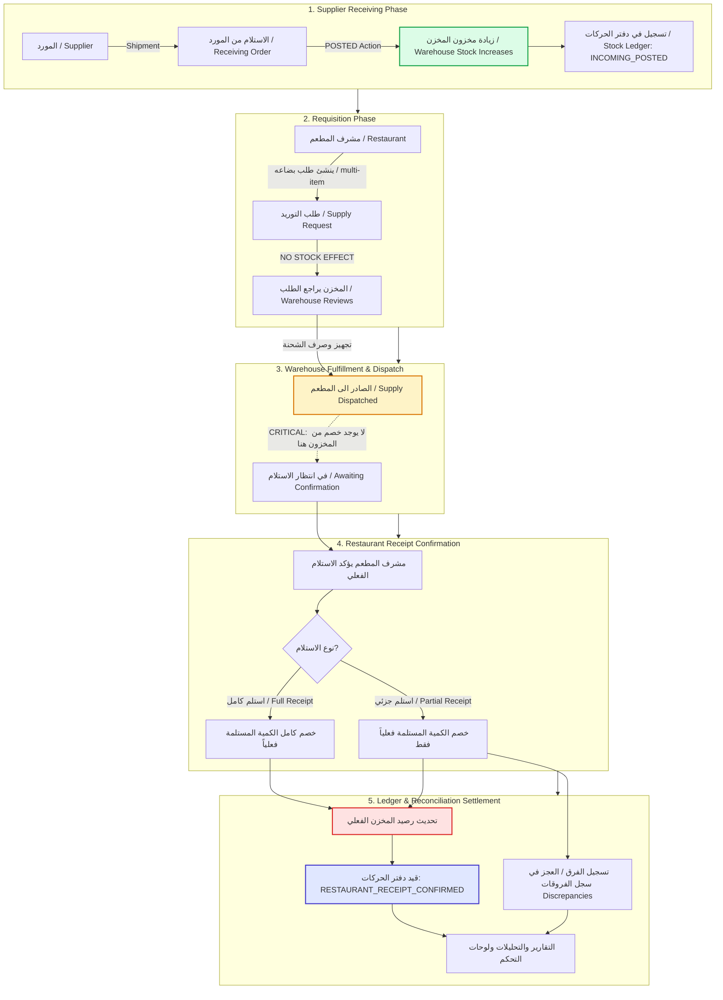

# End-to-End System Architecture & Operational Flow

> **Document ID:** SPEC-FLOW-01  
> **Topic:** Complete Organizational Topology & Supply Chain State Flow  
> **Status:** ⚠️ **NON-NORMATIVE OVERVIEW** (CR-002). The master business-flow authority is **`docs/04-end-to-end-business-flow.md`**; this document is a topology and lifecycle summary and may never introduce a rule the master flow does not state.
>
> **Two simplifications below are superseded by the master flow:**
> - The diagram collapses fulfilment and dispatch into one step. They are **two distinct acts**: fulfilment creates a `Supply` in `Prepared` (`قيد التجهيز`); dispatch transitions it to `Dispatched` (ADR-017). Neither touches stock.
> - The supply request does not show warehouse derivation. The Restaurant Supervisor **never selects a warehouse**; the backend derives it from `restaurants.default_serving_warehouse_id` (ADR-028).

---

## 1. Company Organizational Topology

Every operational object is strictly isolated under a multi-tenant `Company` container:

```
┌────────────────────────────────────────────────────────────────────────┐
│                          Company (الشركة)                              │
│                 Isolated by immutable companyId                        │
└───────────────────────────────────┬────────────────────────────────────┘
                                    │
    ┌───────────────────────────────┼───────────────────────────────┐
    │                               │                               │
    ▼                               ▼                               ▼
┌───────────────────────┐   ┌───────────────────────┐   ┌───────────────────────┐
│ Users & Scopes        │   │ Warehouses            │   │ Branches / Restaurants│
│ (المستخدمين والنطاقات) │   │ (المخازن)             │   │ (الفروع / المطاعم)    │
│ • Owner / Admin       │   │ • Holds 100% Stock    │   │ • NO stock balances   │
│ • Warehouse Staff     │   │ • Handles Receiving   │   │ • Creates Requests    │
│ • Restaurant Supervisor│  │ • Fulfills Supplies   │   │ • Confirms Receipts   │
└───────────────────────┘   └───────────────────────┘   └───────────────────────┘
                                    │                               │
    ┌───────────────────────────────┼───────────────────────────────┘
    │                               │
    ▼                               ▼
┌───────────────────────┐   ┌───────────────────────┐
│ Items Catalog         │   │ Suppliers             │
│ (الأصناف)             │   │ (الموردين)            │
│ ├── Categories (الأقسام)  │ • External vendors    │
│ ├── Units (الوحدات)   │ • Deliver goods to    │
│ └── Conversions       │   warehouses          │
└───────────────────────┘   └───────────────────────┘
```

---

## 2. Complete End-to-End Operational Lifecycle Flow



---

## 3. Step-by-Step Technical Execution Matrix

| Step # | Stage Name (AR / EN) | Primary Actor | API Mutation Endpoint | Stock Ledger Impact | Stock Balance Impact | Discrepancy Effect |
| :---: | :--- | :--- | :--- | :--- | :--- | :--- |
| **1** | **الداخل الى المخزن**<br>(Supplier Receiving) | Warehouse Staff | `POST /api/v1/receiving-orders/{id}/submit` | Appends `INCOMING_POSTED` (`+Qty`) | **Increases** (`+Qty`) and recalculates WAC | None (or variance upon physical check) |
| **2** | **طلبات البضاعه**<br>(Supply Request) | Restaurant Supervisor | `POST /api/v1/supply-requests` | **ZERO** (Requisition only) | **ZERO** (Unchanged) | None |
| **3** | **الصادر الى المطعم**<br>(Warehouse Dispatch) | Warehouse Staff | `POST /api/v1/supplies/{id}/dispatch` | **ZERO** (Workflow transition) | **ZERO** (Unchanged) | None |
| **4** | **تأكيد استلام البضاعه**<br>(Receipt Confirmation) | Restaurant Supervisor | `POST /api/v1/supplies/{id}/confirm` | Appends `RESTAURANT_RECEIPT_CONFIRMED` (`-ActualReceivedQty`) | **Decreases** by actual received quantity | If `Received < Dispatched`, logs variance to `discrepancies` table |
| **5** | **دفتر الحركات والتقارير**<br>(Ledger & Analytics) | System Engine | `StockPostingService` | Read projection | Materialized balance updated | Surfaced in Owner/Admin dashboards |

---

## 4. Core Business Mathematical Invariants

### Invariant A: Warehouse Stock Influx (Receiving)
$$\text{Stock}_{\text{new}} = \text{Stock}_{\text{current}} + \text{ReceivedQuantity}$$

### Invariant B: Dispatch Invariance (Zero Deduction)
$$\text{Stock}_{\text{after\_dispatch}} = \text{Stock}_{\text{before\_dispatch}}$$

### Invariant C: Confirmation Deduction (Actuals Only)
$$\text{Stock}_{\text{after\_confirmation}} = \text{Stock}_{\text{before\_confirmation}} - \text{ActualReceivedQuantity}$$

### Invariant D: Discrepancy Recording
$$\text{Variance} = \text{ActualReceivedQuantity} - \text{DispatchedQuantity} \quad (\text{Logged if } \text{Variance} \neq 0)$$
